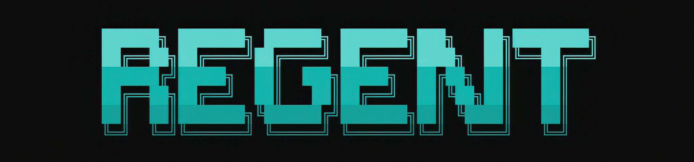

<p align="center">
  
</p>

# Regent ♚

<p>
  
  
  
  
</p>

**Your own AI assistant, living on your computer — not in someone else's cloud.**
It chats in your terminal, talks on live voice calls (and *sees* — your camera and your
screen), messages you on 17+ platforms, fixes code without breaking your project,
remembers everything it learns, and builds real documents. Rust core, single-binary CLI,
your keys and data never leave your machine.

Use any model you want — Anthropic, OpenRouter, OpenAI-compatible hosts, or fully
offline with [Ollama](https://ollama.com). Switch with `regent model` — no code changes,
no lock-in.

| | |
|---|---|
| **A real terminal interface** | Full TUI with streaming replies, slash commands, session history, interrupt/redirect, and approval prompts for anything risky. |
| **Lives where you do** | Telegram, Slack, Discord, WhatsApp, Messenger, LINE, Teams, Google Chat, WeChat, WeCom, Feishu, Twilio SMS/voice, email, Jira, Azure DevOps, Trello, Mattermost — signature-verified, sandboxed by default. |
| **Voice calls with vision** | `regent call` — speech runs locally (whisper + Kokoro). Ask *"are you seeing what I'm seeing?"* (screen) or *"what am I holding?"* (camera). |
| **Careful coding** | `regent code "<task>"` (or just ask in chat) plans first, edits, runs **your repo's own tests**, and reverts everything if they fail. |
| **A closed learning loop** | Tri-modal memory (keyword + semantic + graph), episode capture across sessions, self-authored SKILL.md playbooks, and a curator that prunes what goes stale. |
| **Scheduled automations** | Cron jobs in natural language that survive reboots — daily reports, backups, reminders, delivered to any connected platform. |
| **Real documents** | The bundled `doc-forge` skill builds designed PowerPoint, Word, Excel, PDF, and CSV files — not markdown dumps. |
| **Safe by default** | External messages run filesystem-jailed; their memory writes wait for your approval; dangerous commands stop and ask; secrets live in one owner-only file, masked in every log. |
| **Research-ready** | Eval-gated memory retrieval (recall@5 ≥ 0.75 in CI), 32 architecture decision records, reproducible test suites per crate, full audit trail in [docs/](docs/README.md). |

## Quick Install

### Linux, macOS

```bash
curl -fsSL https://raw.githubusercontent.com/Regent33/Regent/main/scripts/install.sh | sh
```

### Windows (native, PowerShell)

```powershell
irm https://raw.githubusercontent.com/Regent33/Regent/main/scripts/install.ps1 | iex
```

The installer grabs a prebuilt release for your OS (or builds from source if none exists
yet — it tells you exactly what it needs). Everything lands under `~/.regent`.

**After installation:**

```bash
regent          # first launch walks you through setup, then you're chatting
```

Pick **ollama** during setup to run fully local with no API key.

<details>
<summary><b>Build from source instead</b> (Rust 1.96+ and Bun)</summary>

```bash
git clone https://github.com/Regent33/Regent && cd Regent
cargo build --release -p regent-deacon
cd src/regent-cli
bun install
bun run install-cli     # compiles + puts `regent` on your PATH
```

Choose your own install dir: `bun run link -- --dir <path>` (default:
`%USERPROFILE%\.bun\bin` on Windows, `~/.local/bin` elsewhere).
Voice calls additionally need LLVM/libclang —
see [docs/development/](docs/development/voice-and-api-calls.md).
</details>

## Getting Started

```bash
regent                  # interactive CLI — start a conversation
regent call             # live voice call (camera + screen vision)
regent code "<task>"    # plan → edit → test → revert-if-broken coding
regent model            # choose your LLM provider and model
regent cron add …       # schedule automations in natural language
regent gateway          # start the messaging gateway (Telegram etc.)
regent migrate hermes   # import an existing Hermes install (skills & more)
regent doctor           # diagnose any issues
regent help             # everything else
```

Every command also works inside chat as `/command`.

## Documentation

All documentation lives in [docs/](docs/README.md):

| Section | What's covered |
|---|---|
| [Quickstart](docs/QUICKSTART.md) | install → provider → chat → platforms → sandboxing |
| [Commands](docs/reference/commands.md) | every command, annotated |
| [Environment variables](docs/reference/env-vars.md) | every knob, reconciled against the code |
| [Development](docs/development/README.md) | building & testing per toolchain and OS |
| [Architecture decisions](docs/adr/) | 32 ADRs — why things are the way they are |
| [Changelog](docs/CHANGELOG.md) | what changed, when, and how it was verified |

## Migrating from Hermes or OpenClaw

```bash
regent migrate hermes/openclaw     # dry-run by default — shows what would be imported
regent migrate hermes --apply
```

Skills import today (agentskills.io format copies as-is); the source install is never
touched, and existing Regent skills are never overwritten.

## Contributing

Contributions are welcome — see the [Contributing Guide](contributions/README.md) for
setup, code style (domain/application/infra layering), the ADR process, and what goes
where. Small, verified, atomic PRs merge fast.

## License

MIT.

Built by **Regent33 / Rainer Lacanlale**.
