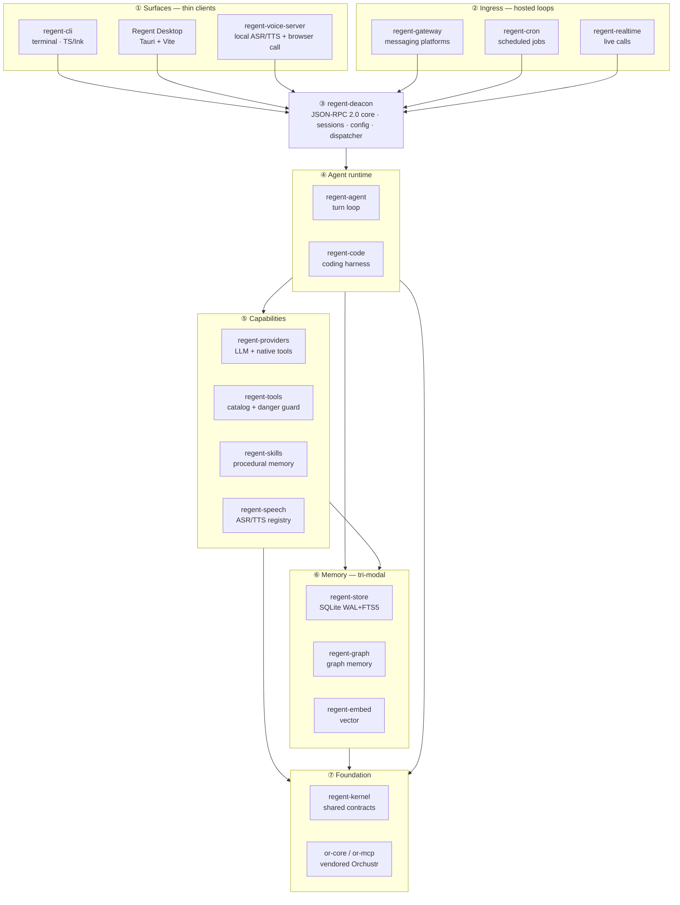
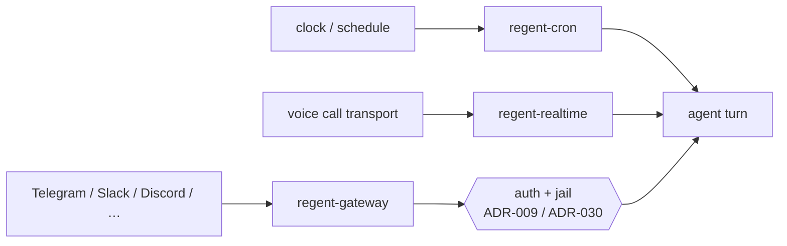
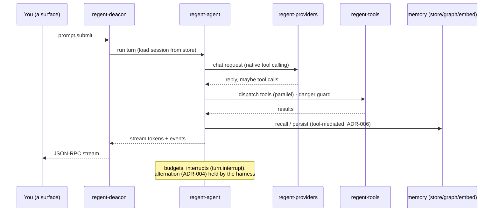
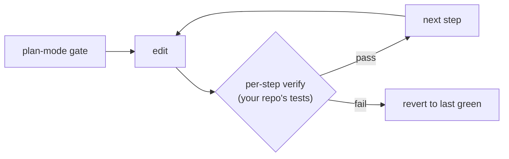
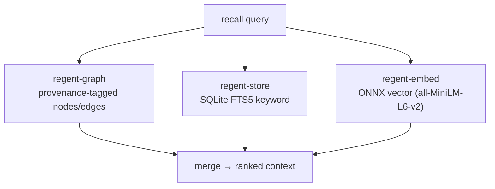

# Regent — Architecture, layer by layer

A visual walkthrough of how Regent is built. For the short version and the "why
one process" argument, read [PROJECT-OVERVIEW](../PROJECT-OVERVIEW.md) first;
this page goes deeper, one layer at a time.

Everything here is drawn from the code: each crate's own `description` in its
`Cargo.toml`, the [architecture decision records](../adr/), and the deacon's
JSON-RPC method list. Nothing is invented — where a claim rests on a decision,
the `ADR-xxx` tag points you at the record.

---

## The whole picture

One long-lived Rust process — **regent-deacon** — does all the thinking. Every
interface is a thin client that talks to it over JSON-RPC 2.0. Fix a behavior
once in the deacon and every surface inherits it.

The arrows from ① and ② are **JSON-RPC 2.0 over stdio** (ADR-011, ADR-033).
Below the deacon, the arrows are ordinary Rust crate dependencies — `path`
dependencies inside one Cargo workspace, so the whole thing builds standalone
(ADR-032).

---

## ① Surfaces — thin clients

The parts you actually touch. Each renders; none of them think.

| Crate / path | What it is |
|---|---|
| `src/regent-cli` | The terminal front-end — TypeScript + [Ink](https://github.com/vadimdemedes/ink), compiled by Bun into one binary (ADR-014). The **sole** CLI plane. |
| `src/regent-app/Desktop` | The desktop app — a Tauri shell over the deacon's stdio JSON-RPC (ADR-033), web layer on Vite + React Router (ADR-034). |
| `regent-voice-server` | "Local speech server — OpenAI-compatible ASR/TTS endpoints + the hands-free browser call" (ADR-029). |
| `src/regent-web` | The small web page `regent call` opens for the hands-free browser call UI, paired with `regent-voice-server`. |

All of them speak the same JSON-RPC vocabulary — `prompt.submit`,
`session.*`, `model.*`, `agents.*`, `memory.*`, and the rest of the method list
below. A behavior lands in the deacon; every surface gets it for free.

---

## ② Ingress — hosted loops

These aren't clients you open — they're loops the deacon hosts, each turning an
outside event into an agent turn.

| Crate | What it is |
|---|---|
| `regent-gateway` | "Messaging gateway: platform adapter contract, auth (allowlist + pairing), session routing, approval-over-chat" (ADR-009). External ingress is **jailed**, and its memory writes are **staged for approval** (ADR-030). |
| `regent-cron` | "Prospective memory: scheduled agent jobs with tick locking, catch-up clamps, and hard timeouts" (ADR-008). |
| `regent-realtime` | "Real-time voice-call engine: a transport-agnostic relay between a call transport and a speech-to-speech provider, bridging tool calls to Regent's tools" (ADR-018, ADR-021). |

The rule that makes this safe: **auth before everything**. A message from
outside is authenticated and sandboxed before it can reach a tool, and anything
it wants to remember waits for your yes.

---

## ③ regent-deacon — the core

> "Long-lived JSON-RPC 2.0 core process: session management, config loading,
> all-crate composition root."

This is the boundary. It loads one `config.yaml`, owns the SQLite database,
composes every crate below, and answers a single JSON-RPC method table. A
sample of the real surface (grouped):

| Group | Methods |
|---|---|
| Conversation | `prompt.submit` · `turn.interrupt` · `session.create/resume/history/list/search/…` |
| Models | `model.get/set/list` · `providers.list/models/catalog/test` |
| Memory | `memory.list/graph/pending/approve/reject/pin/forget` |
| Agents & skills | `agents.list/set/show/remove` · `skills.list/create/opt_in/opt_out/view` |
| Coding | `code.plan` · `code.start` |
| Automation | `cron.add/edit/list/remove/run/set_enabled` · `kanban.*` |
| Voice | `voice.models/ensure_models/set/status/test` |
| Config & persona | `config.get/set` · `persona.get/set` · `env.*` |

Internally the deacon follows crate-internal clean architecture — `domain/`,
`application/`, `infra/` (ADR-007) — visible in its own source tree
(`src/crates/regent-deacon/src/{domain,application,infra}`).

---

## ④ Agent runtime

The loop that turns a prompt into a reply, and the coding harness built on top.

| Crate | What it is |
|---|---|
| `regent-agent` | "The Regent turn loop: harness-owned budgets, interrupts, parallel tool dispatch, persistence." Message alternation is enforced by construction (ADR-004); compaction is a child-session split, never history mutation (ADR-005). |
| `regent-code` | "Coding harness over regent-agent: plan-mode gate → edit → per-step verify → revert-to-last-green" (ADR-027). |

### What a chat turn looks like

### The coding harness

---

## ⑤ Capabilities

What the agent can actually do. Each is a crate the runtime calls into.

| Crate | What it is |
|---|---|
| `regent-providers` | "LLM chat providers with native (OpenAI-style) tool calling, built on or-core retry/budget primitives." Multi-provider registry, per-agent models (ADR-026). |
| `regent-tools` | "Regent tool catalog, dangerous-command guard, and core tool executors (terminal, files, search)." MCP is the plugin surface; toolsets are deferred until needed (ADR-010, ADR-031). |
| `regent-skills` | "Procedural memory: skills library (agentskills.io-compatible), usage telemetry, curator lifecycle." |
| `regent-speech` | "Pluggable voice stack: ASR/TTS provider registry, model manager, VAD, and robustness layer. Disabled by default" (ADR-017). |

---

## ⑥ Memory — tri-modal

Three lanes, one database. A recall query fans out to all three and the results
are merged (ADR-013); recall is mediated by a tool, not injected blindly (ADR-006).

| Crate | Lane | What it is |
|---|---|---|
| `regent-store` | keyword + system of record | "SQLite (WAL + FTS5) persistence: sessions, messages, search" (ADR-003). |
| `regent-graph` | graph | "Graph memory engine: provenance-tagged nodes/edges, bounded prompt stores, hybrid FTS+graph retrieval" (ADR-006). |
| `regent-embed` | semantic | "Local ONNX text embeddings (fastembed / all-MiniLM-L6-v2) — the semantic lane of tri-modal memory." |

The graph lives inside the session database, so memory and conversation share
one file and one transaction boundary (ADR-006).

---

## ⑦ Foundation

The contracts and vendored primitives everything above is built on.

| Crate | What it is |
|---|---|
| `regent-kernel` | "Shared contracts for Regent: messages, transcript invariants, tool definitions, failures." The vocabulary every other crate imports. |
| `or-core` / `or-mcp` | Vendored [Orchustr](../adr/) primitives — retry/budget and the MCP tool surface. Regent adopts them selectively and owns its own tool-calling provider layer (ADR-002); they're vendored in-repo so Regent builds standalone (ADR-032). |

---

## How to read the dependency direction

Arrows point **downward only** — a surface depends on the deacon, the deacon on
the runtime, the runtime on capabilities and memory, and everything bottoms out
at the kernel. Nothing lower reaches back up. That one-way flow is what lets the
learning loop run as a whitelisted sub-agent instead of tangling into the core
(ADR-007), and it's why swapping a provider or adding a platform never touches
the layers above it.

Full rationale for every decision cited here lives in [docs/adr/](../adr/).
