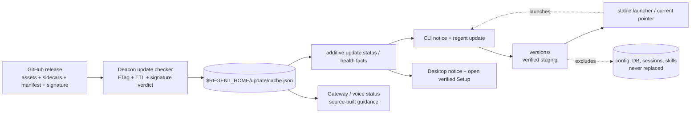

# Plan — Cross-component compatibility, update notification, and auto-update

**Date:** 2026-07-24 · **Status:** Phase 0 implemented and verified; Phases 1–2 pending

## 1. Goal

Give Regent one coherent way to report component compatibility, notify users of a
new release, update safely, and roll back without breaking config, sessions, wire
schemas, or user data.

Rollout is deliberately staged:

1. **Truth + notify only.** Fix version drift, publish one manifest, cache one check.
2. **Manual update.** Verified, side-by-side updates for one-line installations.
3. **Opt-in automatic update.** Signed manifests, stage in the background, activate
   on a cold start. GUI application replacement remains installer-driven.

Phase 0 now implements version truth, the release manifest, cached notification,
and fail-silent CLI/Desktop notices. It does not download or apply updates.

## 2. Baseline gaps found by the audit

- Rust crates used the workspace version while CLI/Tauri copies drifted: Desktop
  declared `0.0.0` and deacon health returned a hard-coded `0.1.0`. Phase 0 aligns
  them and adds a cross-platform parity gate.
- The live call protocol was `7` in Rust/Desktop but `4` in the CLI. Phase 0 aligns
  it and verifies every copy against the Rust source of truth.
- Prompt schema v4, store schema 8, config schema 2, and JSON-RPC v1 each have their
  own compatibility rules, but no response reports them together.
- Releases contain the CLI and deacon archive plus per-asset SHA-256 sidecars. GUI
  Setup publishes Windows NSIS and Linux AppImage artifacts. Gateway, voice server,
  and MCP binaries remain source-built and cannot honestly be auto-updated yet.
- No update checker, conditional GET cache, capability negotiation, staging journal,
  or rollback mechanism exists.

The relevant seams are the deacon dispatcher, CLI/deacon location code, voice health
protocol, release workflows, one-line installers, GUI installer wiring, and store
schema gate. See proposed [ADR-041](../adr/ADR-041-cross-component-update-system.md).

## 3. Requirements

### Functional

- Every surface can show the installed release, component versions, protocol facts,
  update availability, and an actionable compatibility warning.
- `regent update` supports check, verified manual apply, offline archive, status, and
  rollback for supported layouts.
- Automatic updates are off by default and require a signed manifest.
- Running processes and user data survive staging, activation, failure, and rollback.
- Old peers tolerate new fields; new peers treat absent fields as an old capability.

### Non-functional

- One conditional request per Regent home per day, with deterministic jitter and
  ETag caching. Update checks never block startup or a chat turn.
- No URLs from remote data, no shell interpolation, no self-elevation, no unsigned
  unattended execution, and no archive extraction outside staging.
- New modules stay at 200 lines or fewer and use stdlib/existing dependencies.
- Errors name the failed component, verification step, recovery action, and whether
  the current installation was left untouched.

## 4. Architecture



### 4.1 One fetcher, many readers

The deacon is the sole background checker. It performs a detached conditional GET,
validates and caches the manifest, then exposes additive `versions`, `protocols`,
`capabilities`, and `update` facts through existing health/status RPCs. CLI and
Desktop query the RPC; gateway and voice may read the same cache when no RPC is
available. Network failure keeps the previous cache and emits no user-facing startup
error.

### 4.2 One canonical release manifest

A fan-in release job creates the manifest only after all matrix assets and sidecars
exist. It contains names, sizes, hashes, component versions, and protocol facts —
**never download URLs**. Clients derive the official GitHub release URL and reject
asset names outside a strict allowlist. Unknown fields and components are ignored.

Example:

```json
{
  "schema": 1,
  "generated_at": "2026-07-24T12:00:00Z",
  "channels": {
    "stable": {
      "version": "0.1.2",
      "released_at": "2026-07-24T12:00:00Z",
      "minimum_supported": "0.1.0",
      "protocols": {
        "deacon_rpc": { "min": 1, "max": 1 },
        "call": { "min": 7, "max": 7 },
        "prompt_schema": 4,
        "store_schema": 8,
        "config_schema": 2
      },
      "components": {
        "core": {
          "version": "0.1.2",
          "contains": ["regent-cli", "regent-deacon"],
          "assets": {
            "windows-x86_64": {
              "name": "regent-windows-x86_64.zip",
              "sha256": "...",
              "size": 48211234
            },
            "linux-x86_64": {
              "name": "regent-linux-x86_64.tar.gz",
              "sha256": "...",
              "size": 45120000
            }
          }
        },
        "desktop-windows": { "version": "0.1.2", "apply": "installer" },
        "desktop-linux": { "version": "0.1.2", "apply": "installer" }
      },
      "rollback": { "minimum_core": "0.1.1", "store_schema": 8 }
    }
  },
  "signing_key_id": "regent-2026a"
}
```

The detached `regent-manifest.json.sig` signs the exact manifest bytes. Signature
rotation is additive through `signing_key_id`; automatic mode accepts only embedded
trusted keys. Manual mode keeps today's fail-closed SHA-256 bar, while displaying
whether signature/provenance verification was available.

### 4.3 Compatibility is additive capability negotiation

`health` gains optional fields rather than a required handshake:

```json
{
  "version": "0.1.2",
  "components": { "deacon": "0.1.2", "cli": "0.1.2" },
  "protocols": { "deacon_rpc": 1, "call": 7, "store_schema": 8 },
  "capabilities": ["update.status.v1"]
}
```

Absence means an older peer. Callers degrade to legacy behavior; they do not refuse a
connection merely because the new fields are missing. Breaking wire changes still
require a protocol bump and an overlap window where both versions are understood.

## 5. Safe apply model

### One-line CLI installations

Do not overwrite a running Windows executable. Future installers place core bundles
under `$REGENT_HOME/versions/<version>/`:

- POSIX keeps the public `regent` symlink stable and atomically swaps its target.
- Windows keeps `regent.cmd` stable; it reads a small validated current-version file
  and launches that version's CLI. The CLI finds its sibling deacon.
- The previous version remains installed until the new version completes a deacon
  health round-trip. Rollback only changes the pointer.
- Existing flat `bin/` installs migrate once during the first manual update, retaining
  the old binaries as the first rollback generation.

Automatic mode may download and verify in the background, but activation is marked
pending and occurs on the next cold CLI start. It never kills an active conversation.

### GUI installations

- Windows Desktop update remains a verified Setup download + explicit user launch
  until Authenticode signing is active. No silent unsigned executable launch.
- Linux AppImage update remains manual in the first two phases.
- macOS GUI remains blocked until Apple Developer ID signing exists; core one-line
  installs may still use the versioned layout.
- The GUI never assumes its bundled deacon may be independently replaced unless its
  manifest declares that mixed version pair compatible.

### Source-built components

Gateway, voice server, and MCP report their versions and compatibility, but the
updater gives exact source-build guidance while they are absent from release assets.
Library crates are never update targets; they are part of the binary that contains
them.

## 6. Failure and recovery rules

| Failure | Required behavior |
|---|---|
| Missing/malformed manifest or sidecar | Keep current version; cache a bounded diagnostic; no startup failure. |
| Hash/signature mismatch | Delete staging, refuse apply, name the failed check. |
| Archive traversal or unexpected file | Reject before writing outside the version staging directory. |
| Disk full | Preflight manifest size on the same volume; current pointer unchanged. |
| Power loss | Verified version directory may remain, but pointer/journal determines the only active version. |
| New deacon health failure | Restore previous pointer and preserve failed version for diagnostics. |
| Store schema bump | Stop deacon, make a verified DB backup, then apply. Immediate health rollback restores the backup. |
| Old binary opens newer DB | Fail closed with installed/store versions and update/restore guidance. |
| Downgrade/replay | Refuse versions/dates older than the trusted cache unless the user explicitly requests a manual rollback. |
| Protected install directory | Never elevate from the CLI; direct the user to the signed GUI installer. |
| GitHub unavailable/offline | Use stale cache; support `regent update --archive <path>` with sidecar/signature files. |

## 7. Implementation phases

### Phase 0 — Version truth and notify-only

1. Replace the deacon's hard-coded version with `env!("CARGO_PKG_VERSION")`.
2. Align Desktop/CLI/Tauri package versions and call-protocol constants; add Linux +
   Windows CI parity checks so release and protocol drift fails before merge.
3. Add small deacon update-check modules for manifest parsing, ETag cache, semantic
   version comparison, deterministic jitter, and `update.status` RPC.
4. Add a same-run release fan-in job and manifest builder; retain per-asset sidecars.
5. Add CLI status/doctor notice and Desktop update banner. Notify only; no apply path.
6. Document `REGENT_NO_UPDATE_CHECK=1` and stable-channel behavior.

Verification: parser/cache unit tests; malformed/unknown-field compatibility; offline
startup timing; one network request per TTL; fabricated old/current/new manifests;
version/protocol parity CI; existing Rust/CLI/Desktop gates.

### Phase 1 — Verified manual updates

1. Migrate one-line installers to version directories and stable launchers while
   preserving existing paths and rollback generation.
2. Add `features/update/` CLI modules for layout detection, manifest verification,
   secure extraction, staging, pointer journal, health check, offline archive, and
   rollback. Keep each module/test below 200 lines.
3. Add DB backup/restore for releases that bump store schema and fail closed when an
   older binary sees an unsupported newer schema.
4. Add Desktop action that opens the verified platform Setup; do not self-elevate.
5. Add scratch-home power-loss, hash, traversal, migration, rollback, Unicode path,
   and mixed-version tests on Windows/Linux/macOS.

Verification: install vN → stage vN+1 → health → pointer switch; kill at every journal
phase; rollback byte-checks binaries and DB; active sessions remain on vN; new starts
use vN+1; config/keys/sessions/skills hashes remain unchanged.

### Phase 2 — Signed opt-in automatic updates

1. Provision an Ed25519 release-signing key and publish detached signatures. Existing
   `ed25519-dalek`, `sha2`, and `reqwest` avoid new Rust dependencies.
2. Add additive config defaults: `update.mode = notify|manual|auto` and
   `update.channel = stable` without bumping config shape destructively.
3. Auto mode stages only a signed, monotonic official release; activation remains a
   next-cold-start pointer switch with automatic health rollback.
4. Keep Desktop installers, ffmpeg, downgrades, and source-built components manual.

Phase 2 is blocked until signing-key ownership, rotation, and recovery are approved.

## 8. Likely files

- `src/crates/regent-deacon/src/application/dispatcher/mod.rs`
- `src/crates/regent-deacon/src/infra/update_check/{mod,model,cache,tests}.rs`
- `src/crates/regent-store/src/infra/db.rs`
- `src/regent-cli/src/features/update/{cli,domain,infrastructure}/`
- `src/regent-cli/src/features/voice/cli/voiceServe.ts`
- `src/regent-app/Desktop/...` status/banner integration
- `scripts/install.sh`, `scripts/install.ps1`, and focused script tests
- `.github/workflows/release.yml`, `.github/workflows/ci.yml`
- `scripts/release/make-manifest.*`, `scripts/tests/verify-versions.*`
- README, Quickstart, environment reference, changelog, and this ADR

## 9. Decisions and non-goals

- Stable channel only initially; beta/nightly wait for a real release need.
- No custom update server, fleet service, TUF framework, or package-manager rewrite.
- Official auto-update is signature-gated; `REGENT_REPO` remains a manual/testing
  override and cannot bypass the embedded signing key.
- Desktop `package.json` should align with the workspace version; `0.0.0` is treated
  as drift, not a special versioning scheme.
- Do not add gateway/voice/MCP release artifacts in Phase 0. The manifest can add
  them later without a schema break.

## 10. Engineering execution discipline

Implementation should follow plan → approval → isolated verified phases. Re-read files
before edits because parallel sessions share the tree. When an implementation session
approaches roughly **500k context**, write the active decisions, exact diff scope,
verification evidence, and unresolved failures to the plan/handoff before compacting.
Compaction must preserve security gates, schema contracts, rollback state, and the
always-on constitution.
